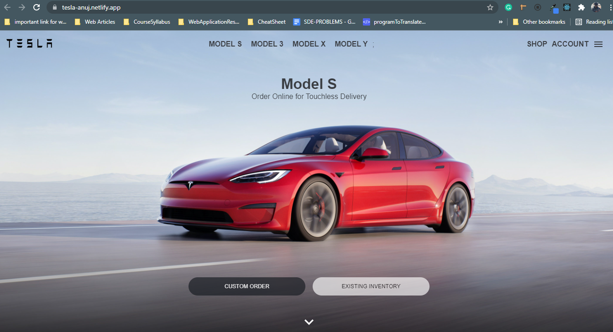
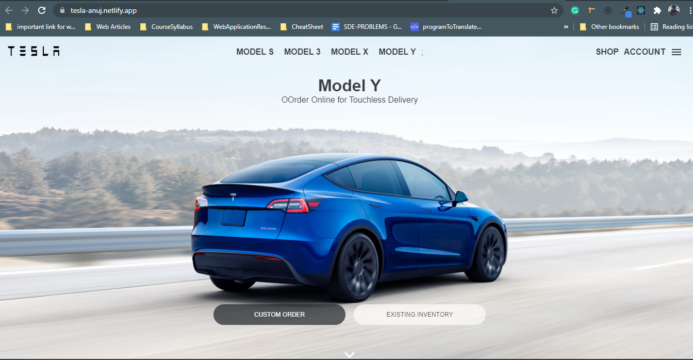
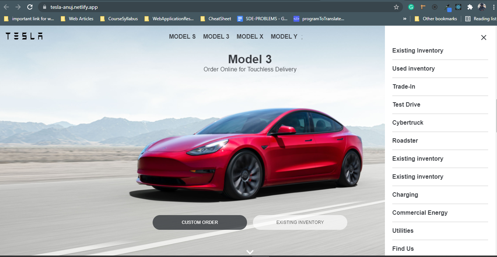
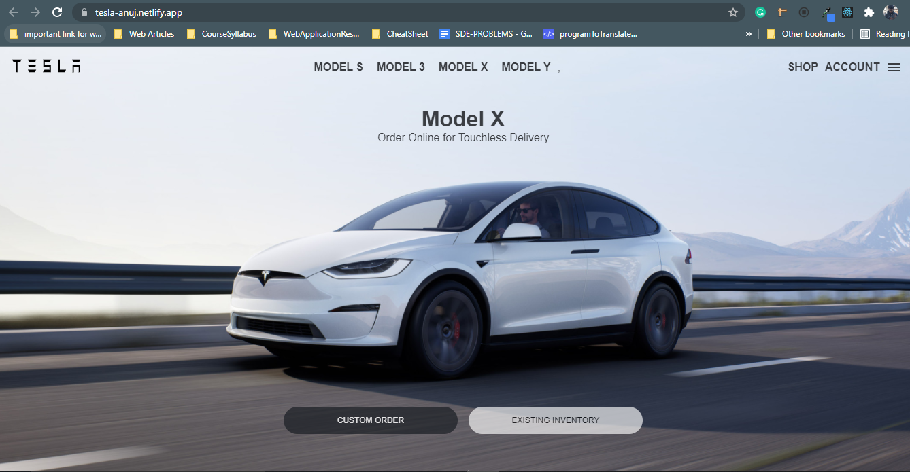
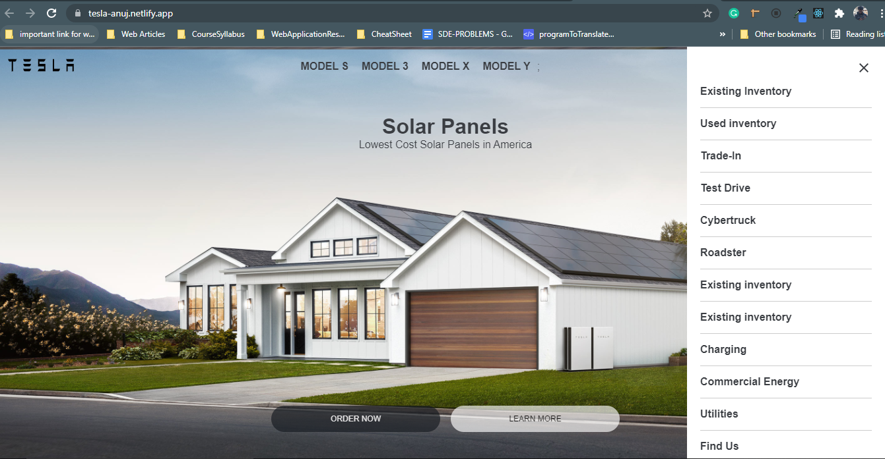
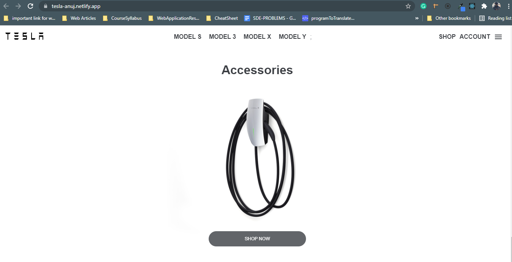

<h2>Tesla-Clone</h2>
In the project directory, I have made a clone of tesla.com

<hr/>
<h3>Tool-kit & languages Used</h3>

* React
* JavaScript
* React Redux
* React Router Dom
* react-dom
* react-redux
* react-router-dom
* react-scripts
* redux
* styled-components
* react-reveal
* material-ui


<hr/>

## Sneak Peak
#### Landing Page
<a href="https://tesla-anuj.netlify.app/">tesla-anuj.netlify.app</a>

#### Tesla Pages


<hr/>

<hr/>

<hr/>

<hr/>

<hr/>

<hr/>

## Installation and Setup Instructions
Clone down this repository using this <a href="https://github.com/Anujsharma2590/tesla.com-clone-react-redux">link</a>

You will need node and npm installed globally on your machine. 

Inside Client install with npm


```bash
  npm install
```

To Run Test Suite: npm test To Start Server: npm start

To Visit App: localhost:3000/****
